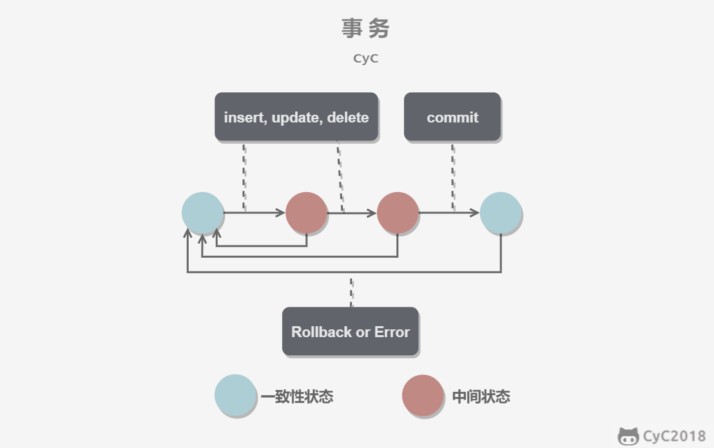
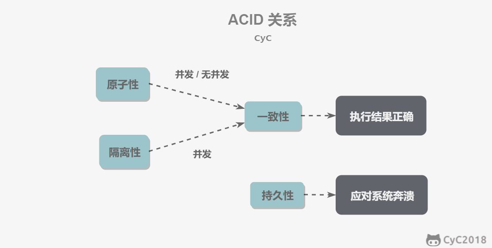
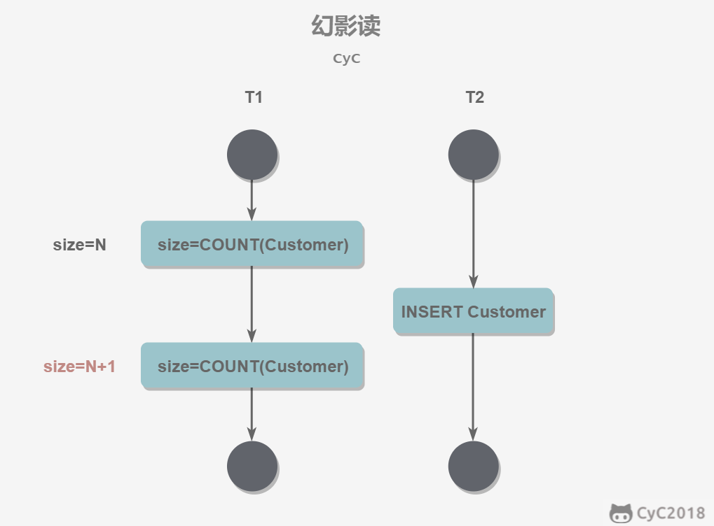
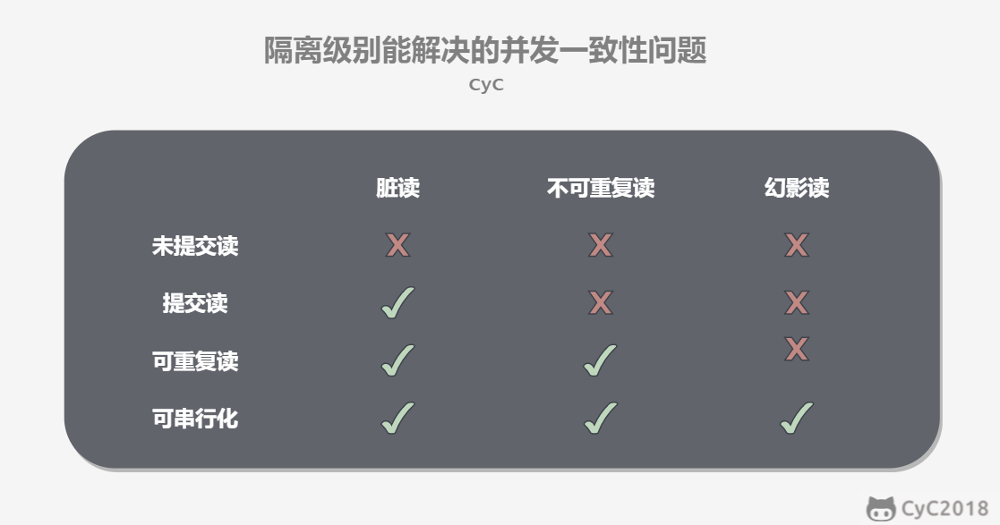

# 数据库事务

### 什么是数据库事务？数据库事务有哪些特性？

#### 概念

1. 事务（Transaction）指的是满足 ACID 特性的一组操作，可以通过 Commit 提交一个事务，也可以使用 Rollback 进行回滚。
2. 事务（Transaction）是一个操作序列，不可分割的工作单位，以BEGIN TRANSACTION开始，以ROLLBACK/COMMIT结束

> 来自于大神[CYC](https://github.com/CyC2018/CS-Notes/blob/master/notes/%E6%95%B0%E6%8D%AE%E5%BA%93%E7%B3%BB%E7%BB%9F%E5%8E%9F%E7%90%86.md)的数据库技术知识整理

#### 特性（ACID）

* **原子性（Atom）：**
  * 事务被视为不可分割的最小单元，事务的所有操作要么全部提交成功，要么全部失败回滚。
  * 回滚可以用回滚日志（Undo Log）来实现，回滚日志记录着事务所执行的修改操作，在回滚时反向执行这些修改操作即可。
* **一致性（Consistency）：**
  * 数据库在事务执行前后都保持一致性状态。
  * 在一致性状态下，所有事务对同一个数据的读取结果都是相同的。
* **隔离性（Isolation）：**
  * 一个事务所做的修改在最终提交以前，对其它事务是不可见的。
  * 隔离性是保证事务并发的条件之一
* **持久性（Durability）：**
  * 一旦事务提交，则其所做的修改将会永远保存到数据库中。
  * 即使系统发生崩溃，事务执行的结果也不能丢失。


有时候面试回答到系统崩溃，有可能会问你如何处理系统崩溃问题

### 如何处理系统崩溃问题？

* 系统发生崩溃可以用重做日志（Redo Log）进行恢复，从而实现持久性。
* 与回滚日志记录数据的逻辑修改不同，重做日志记录的是数据页的物理修改。



事务的ACID概念字面意思很简单，但是不是很好理解

### 如何理解事务的ACID？（或者说是ACID的意义是什么？）

\(这里参考了大神[cyc](https://github.com/CyC2018/CS-Notes/blob/master/notes/%E6%95%B0%E6%8D%AE%E5%BA%93%E7%B3%BB%E7%BB%9F%E5%8E%9F%E7%90%86.md)的整理\)

* 只有满足一致性，事务的执行结果才是正确的。
* 在无并发的情况下，事务串行执行，隔离性一定能够满足。此时只要能满足原子性，就一定能满足一致性。
* 在并发的情况下，多个事务并行执行，事务不仅要满足原子性，还需要满足隔离性，才能满足一致性。
* 事务满足持久化是为了能应对系统崩溃的情况。


> ACID关系如下图所示


### 关于 AUTOCOMMIT ：

* MySQL 默认采用自动提交模式。也就是说，如果不显式使用START TRANSACTION语句来开始一个事务，那么每个查询操作都会被当做一个事务并自动提交。


### 为什么会发生并发一致性问题？

在并发环境下，事务的隔离性很难保证，因此会出现很多并发一致性问题。

### （事务的执行）会发生哪些并发一致性问题？

* **丢失修改：**
  * **丢失修改指一个事务的更新操作被另外一个事务的更新操作替换**
    * **eg.** T1 和 T2 两个事务都对一个数据进行修改，T1 先修改并提交生效，T2 随后修改，T2 的修改覆盖了 T1 的修改

* **脏读：**
  * **读脏数据指在不同的事务下，当前事务可以读到另外事务未提交的数据。**
    * **eg.** T1 修改一个数据但未提交，T2 随后读取这个数据。如果 T1 撤销了这次修改，那么 T2 读取的数据是脏数据。

* **不可重复度：**
  * 指在一个事务内多次读取同一数据集合。
  * 在这一事务还未结束前，另一事务也访问了该同一数据集合并做了修改，由于第二个事务的修改，第一次事务的两次读取的数据可能不一致。
    * **eg.** T2 读取一个数据，T1 对该数据做了修改。如果 T2 再次读取这个数据，此时读取的结果和第一次读取的结果不同。

* **幻读：**
  * 幻读本质上也属于不可重复读的情况
  * 当同一查询多次执行时，由于其它事务在这个数据范围内执行了**插入**操作，会导致每次返回不同的结果集
    * **eg.** T1 读取某个范围的数据，T2 在这个范围内插入新的数据，T1 再次读取这个范围的数据，此时读取的结果和和第一次读取的结果不同。


### 产生并发不一致问题的主要原因是?

* 破坏了事务的隔离性，解决方法是**通过并发控制来保证隔离性**
* 并发控制可以通过**封锁**来实现，但是封锁操作需要用户自己控制，相当复杂。
* 数据库管理系统提供了事务的**隔离级别**，让用户以一种更轻松的方式处理并发一致性问题。


> 接下来先介绍事务的隔离级别,再介绍封锁

### 数据库的事务隔离级别有哪些?

* **未提交读\(READ UNCOMMITTED\):**
  * 事务中的修改，即使没有提交，对其它事务也是可见的
  * 在一个事务提交之前，它的执行结果对其它事务也是可见的
* **已提交读\(READ CONMMITTED\): 可解决** **脏读 问题**
  * 一个事务只能读取已经提交的事务所做的修改。换句话说，一个事务所做的修改在提交之前对其它事务是不可见的。
* **可重复读\(REPEATABLE READ \):  可解决  脏读 + 不可重复读 问题**
  * 保证在同一个事务中多次读取同一数据的结果是一样的（MySQL的默认隔离级别）
* **串行化\(SERIALIZABLE\):  可解决  脏读 + 不可重复读 + 幻读 问题**
  * 强制事务串行执行，这样多个事务互不干扰，不会出现并发一致性问题。
  * 该隔离级别需要加锁实现，因为要使用加锁机制保证同一时间只有一个事务执行，也就是保证事务串行执行。
  * 可能导致大量的超时现象和锁竞争，实际很少使用。

